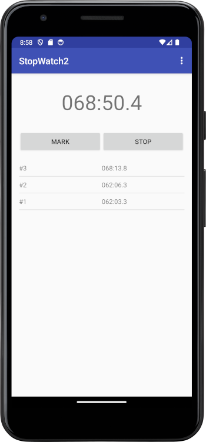

# stopwatch2 - Android Stopwatch Application

## Description

The core feature of this stopwatch is that it counts indefinitely after 60 seconds.
It does not round to minutes, but keeps incrementing the seconds.
This is useful for judges or anyone needing to count only seconds indefinitely, not full hours.

It allows users to start, stop, and reset a timer, as well as log lap times. This application is designed to be straightforward and easy to use, 
making it perfect for tracking workouts, cooking times, or any other timed activity.

## Features

*   **Start/Stop/Reset:** Control the timer with simple start, stop, and reset actions.
*   **Lap Times:** Record and display lap times.
*   **Clear history:** Remove all the saved lap times.
*   **Copy to clipboard**: Copy the currently shown time into the clipboard.
*   **Edit Time**: Modify the currently displayed time, to start counting down from a specific time.

## Development Environment Setup

To set up the development environment for this project, follow these steps:

1.  **Install Android Studio:**
    *   Download and install the latest stable version of Android Studio from the official Android Developer website: [https://developer.android.com/studio](https://developer.android.com/studio)
2.  **Install the Android SDK:**
    *   During the Android Studio installation process, you will be prompted to install the Android SDK. If you didn't install it then, you can install it later through the SDK Manager in Android Studio (`Tools > SDK Manager`).
3.  **Install Build Tools and Platform Tools**:
    * Ensure that you have installed the recommended build tools for your target `compileSdkVersion`, using the SDK Manager in Android Studio (`Tools > SDK Manager`).
4. **Install Platform Tools**:
    * Ensure that you have installed the latest Platform Tools, using the SDK Manager in Android Studio (`Tools > SDK Manager`).
5. **Set up emulator or connect a physical device**:
    * Set up a new emulator or connect a physical device so you can test the application.
6. **Clone the Repository**:
    * If you have the project in a repository, you should clone it first into your computer.

## Building the Project

1.  **Open in Android Studio:**
    *   Launch Android Studio.
    *   Select "Open" and navigate to the directory where you saved the project (or the directory of the cloned repository).
2.  **Sync with Gradle:**
    *   Once the project is open, Android Studio will prompt you to sync with Gradle files. Click "Sync Now".
3.  **Build the Project:**
    *   Go to `Build > Make Project` to build the entire project. This will compile the code and generate the necessary files.
4.  **Run the App:**
    *   Select the `app` module from the run configuration dropdown in the toolbar.
    *   Click the green "Run" button (or `Shift + F10`) to run the app on an emulator or connected device.

## Project Structure

The main files are:

*   `app/src/main/java/com/vitez/stopwatch2/MainActivity.java`: Contains the logic for the main stopwatch application.
*   `app/src/main/java/com/vitez/stopwatch2/HistoryListAdapter.java`: This class handles the logic of the adapter used to display the lap times.
*   `app/src/main/res/layout/activity_main.xml`: Defines the layout for the main activity.
*   `app/src/main/res/layout/log_times_list_item.xml`: Defines the layout used for each item in the list of lap times.
*   `app/src/main/res/menu/main_menu.xml`: Defines the menu displayed in the top right corner of the app.
*   `app/build.gradle`: Contains build configurations for the app module.
*   `build.gradle`: Contains build configurations for the entire project.
*   `settings.gradle`: Contains general settings for the project.
*   `gradle/wrapper/gradle-wrapper.properties`: Contains the configuration of the Gradle wrapper to be used by the project.
*   `gradle.properties`: Contains general configurations for Gradle.
*   `docs/`: This is where the `screenshot.png` should be placed.
*   `src/main/AndroidManifest.xml`: Contains the manifest that describes the application.

## License

MIT License

## Credits

Created by Andrej Vitez in 2015. for educational purposes.